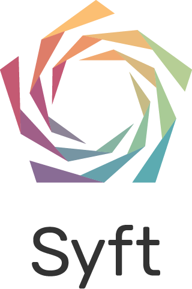

<div align="center">
  
  <h1><strong>Study Heart Disease using PySyft</strong></h1>
</div>

### Welcome! 

In this tutorial we will use PySyft to study heart disease, and by doing so 
we will try to answer the following question: 

> Can we run Machine Learning experiments on _multiple_ and _distributed_ medical datasets, _without seeing the data_?

We are going to to learn _how_! 
All you need to get started is PySyft, and a Jupyter notebook! 🚀

#### Related posts on OpenMined Blog:

1. <a href="https://blog.openmined.org/a-python-package-and-an-email-is-all-you-need/" target="_blank" title="Need more medical data? A Python package and an email is all you need!">Need more medical data? A Python package and an email is all you need!</a>.

2. <a href="https://blog.openmined.org/fl-in-10-lines-of-code-with-pysyft/" target="_blank" title="Federated Learning in 10 lines of Code, with PySyft">Federated Learning in 10 lines of Code, with PySyft</a>.

## Table of Content

- [Getting Started](#getting-started)
- [Table of Content](#table-of-content)
- [Data Description](#data-description)
- [Feedback and Support](#feedback-and-support)
- [Colophon](#colophon)

## Getting Started

### 1. Download the code locally

Using the `git` command from the terminal:

```bash
$ git clone https://github.com/openmined/syft-heart-disease-tutorial
```

or by clicking on `Code >> Local >> Download ZIP` on the repository main page.

### 2. Install PySyft and ML Packages

The repository includes a `requirements.txt` file with the list of 
all the Python packages required to work with the notebooks. 
You can install all these dependencies using `pip`:

```bash
$ pip install -r requirements.txt
```

Please refer to the [Quick Install](https://docs.openmined.org/en/latest/quick-install.html) guide to learn how to install PySyft. 

**Note**: It is recommended to install PySyft and all the dependencies within a dedicated Python virtual environment 
(using the _virtual-env_ manager of choice, e.g. [Miniconda](https://docs.anaconda.com/miniconda/), [pyenv](https://github.com/pyenv/pyenv))

#### 3. Launch the Datasites

Setup and launch the PySyft Datasites using the `launch_datasites.py` script included in the repository. From the command line:

```bash
$ python launch_datasites.py
```

**Note**: Please, keep the terminal open, as this will keep all the servers running in background. You can stop all the servers, and terminate
the program by typing `Ctrl+C`.

## Table of Content

- 🧭 [(Intro) Setup Datasites](./00-Setup-Datasites.ipynb): 
    Familiarise with the data, and the Datasites.
- 📊 [1. Compare Demographics](./01-Compare-Demographics.ipynb): 
    Study the distribution of the demographics in the data, using PySyft.
- 🤖 [2. ML Model Training Experiment](./02-Model-Training-Experiment.ipynb): 
    Use PySyft to train a Machine learning classifier, using data across the four distributed datasites, and _without seeing the data_!  (🌟)
- 📝 [3. ML Model Evaluation Experiment](./03-Model-Evaluation-Experiment.ipynb):
    Assess the performance of the trained classifiers on each remote datasite.  (🌟🌟)
- 🗳️ [4. Ensemble Learning Experiment](./04-Ensemble-learning-Experiment.ipynb):
    Create an Ensemble using all the models trained remotely and independently on each dataset. We will test this strategy to obtain
    a ML predictive model that has seen `4x` more medical data in training. (🌟🌟🌟)
- ⚗️ [5. Federated Learning Experiment](./05-Federated-learning-Experiment.ipynb):
    Run a full Federated Learning experiment using PySyft and Scikit-learn. We'll train a linear classifier on each datasite and explore how to pass model parameters as inputs to a Syft function. (🌟🌟🌟🌟)
- 🔮 [6. Federated Learning Experiment with PyTorch](./06-Federated-learning-Experiment-with-PyTorch.ipynb):
    Run a complete Federated Learning experiment using PySyft and PyTorch. We'll train a non-linear Neural Network across multiple datasites and learn how to leverage PyTorch within PySyft to seamlessly execute FL experiments. (🌟🌟🌟🌟🌟)

## Data Description

We will use the **full** version of the Heart Disease dataset, as available on [UCI ML](https://archive.ics.uci.edu/dataset/45/heart+disease).

This database is the result of a study for the diagnosis of coronary artery disease, as presented in this [paper](https://www.semanticscholar.org/paper/International-application-of-a-new-probability-for-Detrano-J%C3%A1nosi/a7d714f8f87bfc41351eb5ae1e5472f0ebbe0574).

The _full_ dataset contains the data as collected by patients in four different hospitals, in 1988: 
- Cleveland Clinic in Cleveland, Ohio (303 patients);
- Hungarian Institute of Cardiology in Budapest, Hungary (425 patients);
- Veterans Administration Medical Center in Long Beach, California (200 patients)
- University Hospitals in Zurich and Basel (143 patients).

Each Hospital will correspond to a single PySyft Datasite, hosting their corresponding version of the `Heart Study Data`.

### Notes

This dataset is quite popular, and well-known in the data science/machine learning community. However, only the Cleveland database is the one that has been effectively used by ML researchers to date [1](https://archive.ics.uci.edu/dataset/45/heart+disease). The "target" field refers to the presence of heart disease in the patient.  It is integer valued from `0` (no presence) to `4`. In our Machine learning experiments we will treat this problem as a _binary_ (`presence` vs `absence`) classification problem.

#### Acknowledgments

The authors of the dataset have requested that any use of the data include the names of the principal investigator responsible for the data collection at each institution. They would be:

- Hungarian Institute of Cardiology. Budapest: Andras Janosi, M.D.
- University Hospital, Zurich, Switzerland: William Steinbrunn, M.D.
- University Hospital, Basel, Switzerland: Matthias Pfisterer, M.D.
- V.A. Medical Center, Long Beach and Cleveland Clinic Foundation:Robert Detrano, M.D., Ph.D.

## Feedback and Support

If you spot any error or mistake, please feel free to reach out directly to [me via email](mailto:valerio@openmined.org?subject=PySyft%20%HD%20Tutorial%20Issue), or to open an [Issue](http://github.com/openmined/syft-heart-disease-tutorial/issues) on the repository.

Any feedback will be very much appreciated! Thank you! 🙏

### Any question about PySyft? 

For any technical question, or clarification, or _any request for assistance_ with PySyft, please consider 
[joining](https://bit.ly/join-om-slack) the OpenMined slack, and pop your question in the `#support` channel.


## Colophon

**Author**: Valerio Maggio ([`@leriomaggio`](https://twitter.com/leriomaggio)),
Researcher, [SSI Fellow](https://www.software.ac.uk/about/fellows/valerio-maggio),
and Education Team @ Open Mined.

All the **Code** material is distributed under the terms of the Apache License. See [LICENSE](./LICENSE) file for additional details.

All the instructional materials in this repository are free to use, and made available under the [Creative Commons Attribution
license](https://creativecommons.org/licenses/by/4.0/). The following is a human-readable summary of (and not a substitute for) the [full legal text of the CC BY 4.0
license](https://creativecommons.org/licenses/by/4.0/legalcode).

You are free:

* to **Share**---copy and redistribute the material in any medium or format
* to **Adapt**---remix, transform, and build upon the material

for any purpose, even commercially.

The licensor cannot revoke these freedoms as long as you follow the
license terms.

Under the following terms:

* **Attribution** --- You must give appropriate credit, and provide a link to the
  [LICENSE](https://github.com/openmined/syft-heart-tutorial/LICENSE) [`cc-by-human`](https://creativecommons.org/licenses/by/4.0/),
  and indicate if changes were made.
  You may do so in any reasonable manner, but not in any way that suggests the
  licensor endorses you or your use.
  
* **No additional restrictions** --- You may not apply legal terms or
technological measures that legally restrict others from doing
anything the license permits.
